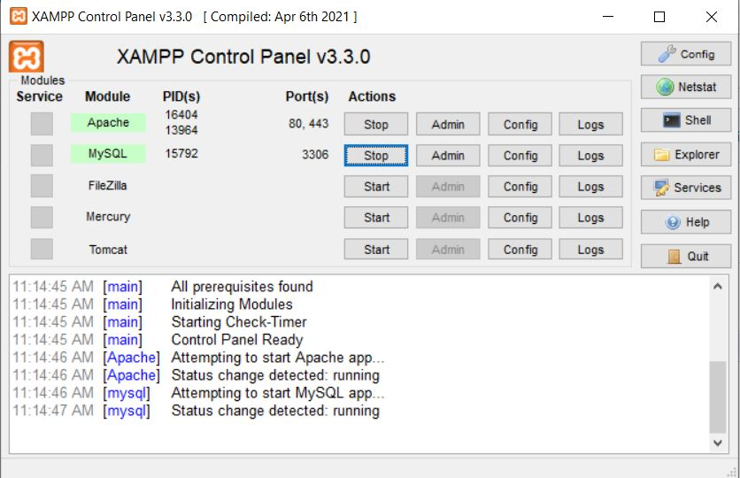
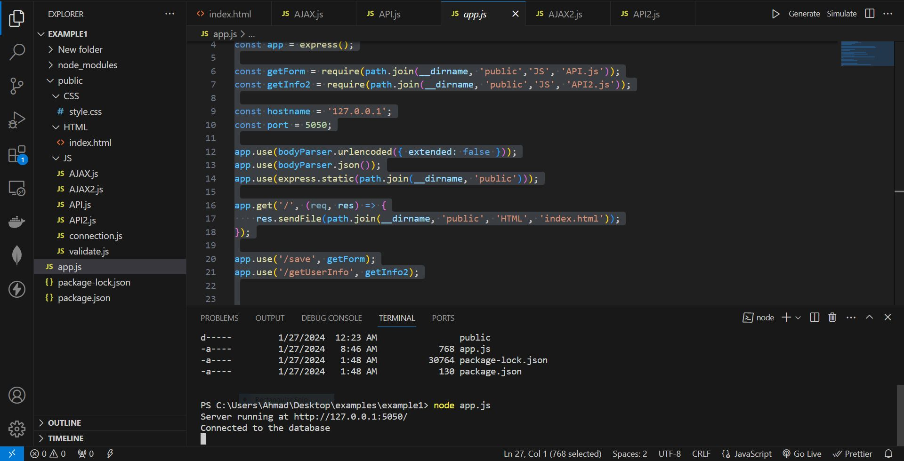
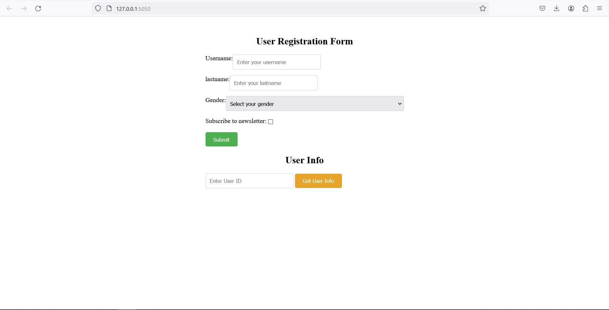

# Simple-Signup-Nodejs

install xampp and run Apache and MySQL



```
run this command:
|
|---for npm libraries:
|   |
|   |--**npm install body-parser**
|   |--```npm install express```
|   |--```npm install mysql```
|   |--```npm install path```
|
|
|---for running server:
    |
    |--```node app.js```
```






